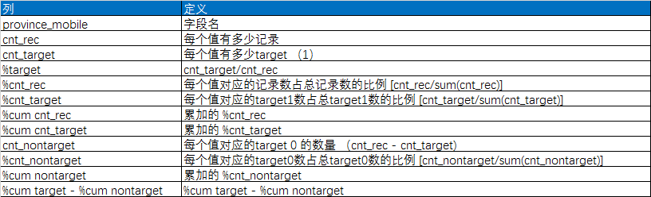

data_analysis
=
1.scripts/stats.py（数据分析脚本）
-
####1) 使用方法 
python  scripts/**stats.py**    输入dataframe所在csv    输出dataframe所在csv    待分析特征变量 

####2) 使用例子 
python  scripts/**stats.py**    'd:\age.csv'    'd:\output.csv'    'age' 

####3) 参数解释 
输入dataframe 
<table>
<tr><td></td><td>UserId</td><td>age</td></tr>
<tr><td>0</td><td>27226838</td><td>22</td></tr>
<tr><td>0</td><td>17126415</td><td>34</td></tr>
<tr><td>0</td><td>47526334</td><td>56</td></tr>
<tr><td colspan="3">...</td></tr>
</table>
 
输出dataframe
<table>
<tr>
<td>age</td><td>cnt_rec</td><td>cnt_target</td>
<td>%target</td><td>%cnt_rec</td><td>%cnt_target</td>
<td>%cum_cnt_rec</td><td>%cum_cnt_target</td><td>cnt_nontarget</td>
<td>%cum_nontarget</td><td>%cum_target-%cum_nontarget</td></tr>

<tr>
<td>18</td><td>110</td><td>9.0</td>
<td>8.18%</td><td>0.36%</td><td>0.53%</td>
<td>0.36%</td><td>0.53%</td><td>101.0</td>
<td>0.35%</td><td>0.18%</td></tr>

<tr><td colspan="11">...</td></tr>
</table>

2.scripts/woe.py（计算[woe](https://www.google.com.hk/url?sa=t&rct=j&q=&esrc=s&source=web&cd=8&cad=rja&uact=8&ved=0ahUKEwjkiYvvvLLSAhXEp5QKHZXxCPcQFghKMAc&url=http%3A%2F%2Fwww.listendata.com%2F2015%2F03%2Fweight-of-evidence-woe-and-information.html&usg=AFQjCNFSOMXCC82266M40O_WCP84PLgBgw)和[iv](https://www.google.com.hk/url?sa=t&rct=j&q=&esrc=s&source=web&cd=8&cad=rja&uact=8&ved=0ahUKEwjkiYvvvLLSAhXEp5QKHZXxCPcQFghKMAc&url=http%3A%2F%2Fwww.listendata.com%2F2015%2F03%2Fweight-of-evidence-woe-and-information.html&usg=AFQjCNFSOMXCC82266M40O_WCP84PLgBgw)脚本） 
-
####1)使用方法 
python  scripts/**woe.py**    输入dataframe所在csv    待分析特征变量   分段表达式（用逗号连接）  y变量 

####2)使用例子 
python  scripts/**woe.py**    "age.csv" "age" "20,30,45" "is_dft" 

####3)参数解释 
输入dataframe 
<table>
<tr><td></td><td>UserId</td><td>age</td><td>is_dft</td></tr>
<tr><td>0</td><td>27226838</td><td>22</td><td>1</td></tr>
<tr><td>0</td><td>27242238</td><td>21</td><td>0</td></tr>
<tr><td colspan="4">...</td></tr>
</table>

输出结果 
<table>
<tr>
<td></td><td>class</td>  <td>good</td>    <td>bad</td>
  <td>%good</td>    <td>%bad</td>    <td>all</td>
        <td>woe</td>        <td>iv</td></tr>
       
<tr>
<td>0</td>  <td>(0,20.0]</td>    <td>76</td>   <td>1519</td>  <td>4.76%</td>  
<td>95.24%</td>   <td>1595</td> <td>-6.34584</td>  <td>0.048765</td></tr>

<tr>
<td>1</td>   <td>(20,30]</td>   <td>895</td>  <td>17129</td>  <td>4.97%</td>  
<td>95.03%</td>  
<td>18024</td> <td>-8.75549</td>  <td>0.561679</td></tr>
<tr>
<td>2</td>   <td>(30,45]</td>   <td>673</td>  <td>10021</td>  <td>6.29%</td>  
<td>93.71%</td>  
<td>10694</td>  <td>7.31007</td>  <td>0.372628</td></tr>

<tr>
<td>3</td>   <td>(45...)</td>    <td>75</td>    <td>869</td>  <td>7.94%</td>  
<td>92.06%</td>    <td>944</td>  <td>2.57974</td>  <td>0.036832</td></tr>

<tr>
<td>4</td>        <td>NA</td>     <td>0</td>      <td>0</td>   <td>nan%</td> 
   <td>nan%</td>      <td>0</td>
      <td>NaN</td>  <td>0.000000</td></tr>

<tr>
<td></td><td></td>
<td>1688</td>  <td>28819</td>  <td>5.53%</td>  <td>94.47%</td>  <td>30507</td>           
<td></td><td>1.019905</td></tr>
</table>